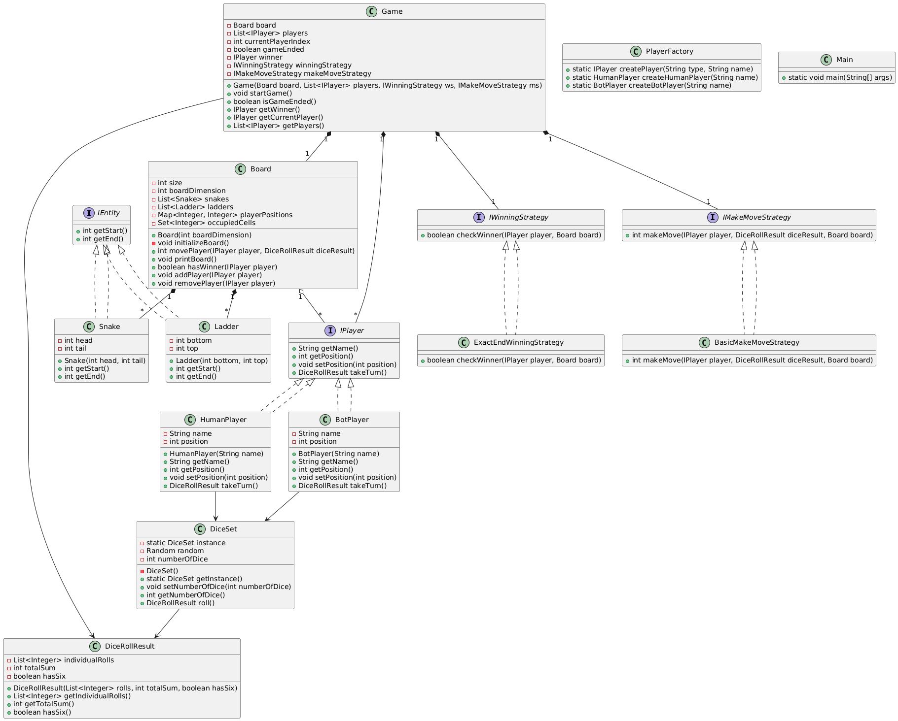

# Snake and Ladders Game - Object Oriented Design

## Overview
A classic Snake and Ladders board game implementation using **Object-Oriented Design principles** and **Design Patterns** in Java.

## UML Class Diagram


## Design Patterns Implemented

### 1. Strategy Pattern
- **WinningStrategy Interface**: Defines different winning conditions
  - `ExactEndWinningStrategy`: Player must reach exactly position 100 to win
- **MakeMoveStrategy Interface**: Defines different movement rules
  - `BasicMakeMoveStrategy`: Standard movement with snake/ladder effects

### 2. Factory Pattern
- **PlayerFactory**: Creates different types of players
  - `createHumanPlayer()`: Creates human player instances
  - `createBotPlayer()`: Creates bot player instances

### 3. Singleton Pattern
- **DiceSet**: Ensures only one dice instance throughout the game

## Core Components

### Interfaces
- **IEntity**: Base interface for board entities (Snake, Ladder)
- **IPlayer**: Player interface for Human and Bot players
- **IWinningStrategy**: Strategy for determining win conditions
- **IMakeMoveStrategy**: Strategy for handling player moves

### Key Classes
- **Game**: Main game engine that orchestrates gameplay
- **Board**: Manages the game board, snakes, and ladders
- **Snake**: Represents snake entities (moves player down)
- **Ladder**: Represents ladder entities (moves player up)
- **HumanPlayer/BotPlayer**: Player implementations
- **DiceSet/DiceRollResult**: Handles dice rolling mechanics

## Game Rules
1. Players start at position 0
2. Roll dice to move forward
3. Landing on a snake head moves you to its tail
4. Landing on a ladder bottom moves you to its top
5. Rolling a 6 gives an extra turn
6. First player to reach position 100 exactly wins
7. If roll exceeds 100, player stays at current position

## How to Run
```bash
# Navigate to src directory
cd src

# Compile all Java files
javac *.java

# Run the game
java Main
```

## Extensibility
The design supports easy extension:
- **New Entities**: Add Blocker, Hole by implementing `IEntity`
- **New Strategies**: Create custom winning/movement strategies
- **New Player Types**: Add AI players with different difficulty levels
- **Multiple Dice**: Configure number of dice via `DiceSet`

## Architecture Benefits
- **Separation of Concerns**: Each class has a single responsibility
- **Open/Closed Principle**: Easy to extend without modifying existing code
- **Strategy Pattern**: Flexible game rules and winning conditions
- **Factory Pattern**: Centralized player creation
- **Interface Segregation**: Clean contracts between components
